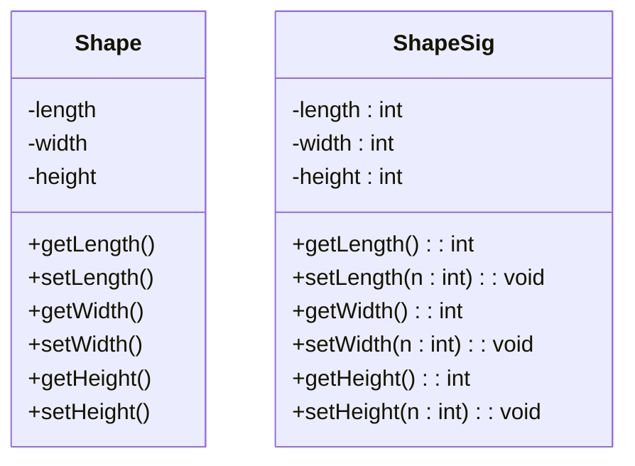

#sample UML diagram for CSC102 by Aimie McElroy<br>
#AIMMCELR@uat.edu

Create a diagram with 2 classes. Those classes need 3 attributes, 3 method

Attributes come before properties or methods<br>
/+ public /- private /# protected

```mermaid
    classDiagram
    class Superclass{
    }

    class Subclass1{
    }

    class Subclass2{
    }

    Superclass <|-- Subclass1
    Superclass <|-- Subclass2